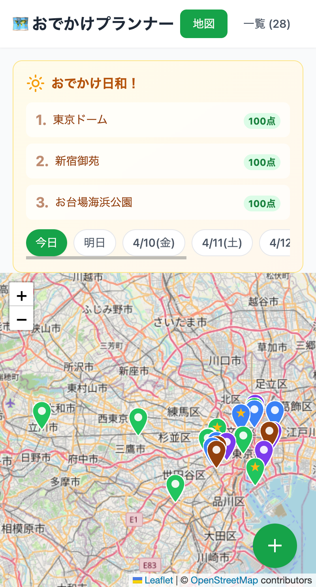
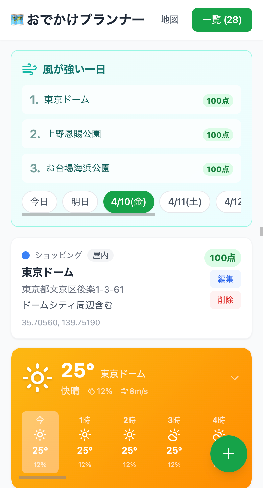
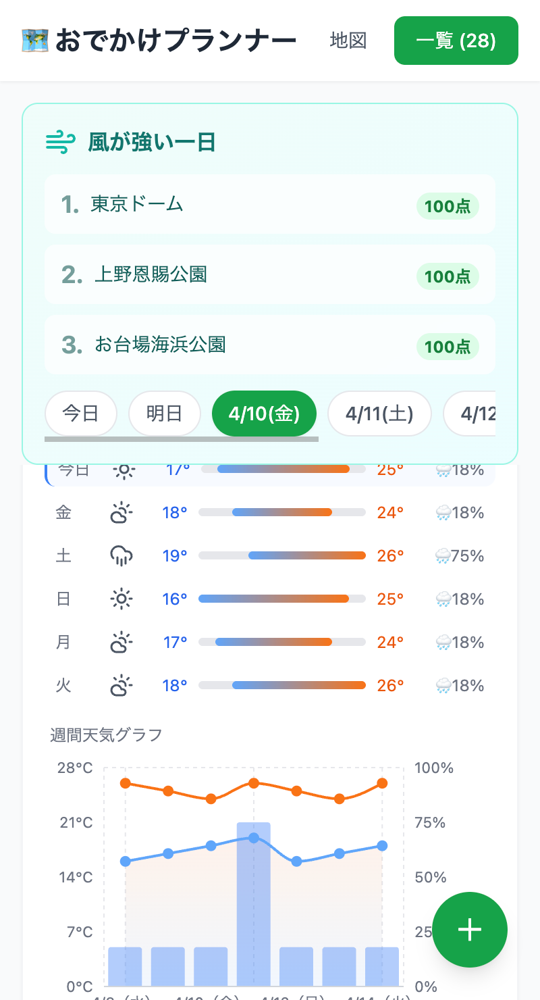
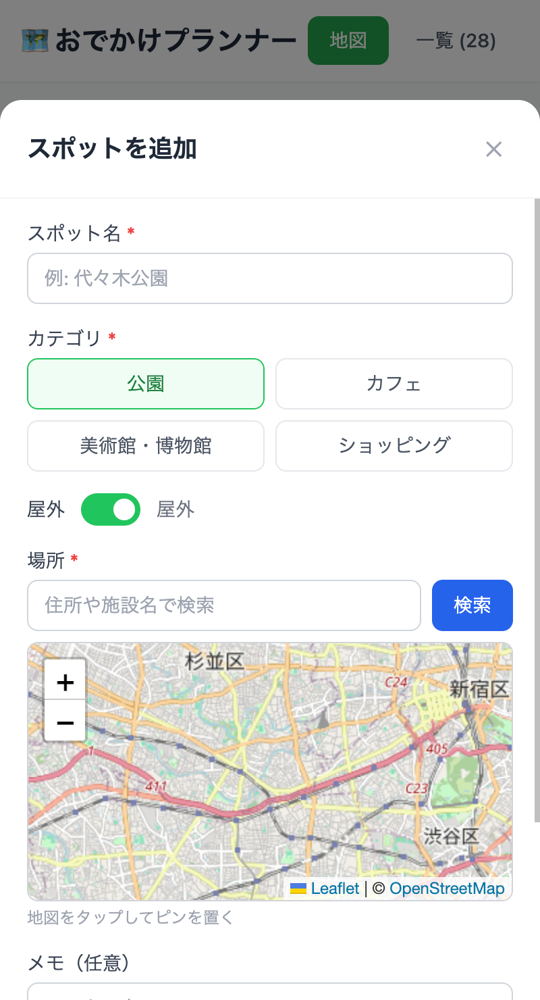

# 実践例：おでかけプランナーを作る

このドキュメントは、[/kickstart スキル](kickstart-skill.md)を使ってプロジェクトをゼロから立ち上げ、Phase Bで開発を進めるまでの実践ガイドです。

実際にこの手順に沿って進めることで、ガイド全体の流れを体験できます。

### こんなアプリが作れます

> 以下は実際にこのウォークスルーに沿って作成したアプリのスクリーンショットです。プロンプトの書き方や判断によって仕上がりは変わるので、あくまで参考イメージとしてご覧ください。

<table>
  <tr>
    <td align="center"><br><b>おすすめ＋地図</b></td>
    <td align="center"><br><b>スポット＋天気</b></td>
    <td align="center"><br><b>週間グラフ</b></td>
    <td align="center"><br><b>スポット登録</b></td>
  </tr>
</table>

> **Note**: このプロジェクトでは以下の外部サービスを使用します。いずれも無料・APIキー不要ですが、実行の際は各サービスの利用ポリシーを確認してください。
> - **Open-Meteo API**（天気データ）: [利用規約](https://open-meteo.com/en/terms)
> - **OpenStreetMap**（地図タイル）: [タイル利用ポリシー](https://operations.osmfoundation.org/policies/tiles/)（帰属表示 `© OpenStreetMap contributors` が必要。Leafletはデフォルトで表示します）

---

## 事前準備

1. Claude Codeがインストール済みであること（[インストール手順](setup.md)）
2. `/kickstart` スキルがインストール済みであること（[セットアップ手順](kickstart-skill.md#セットアップ)）

特別な事前データの準備は不要です。スポットのデータはアプリ上で自分で登録していくCRUDなので、すぐに始められます。

---

## Phase A：プロジェクト立ち上げ

### ステップ0：プロジェクト作成 → /kickstart 実行

```bash
mkdir outing-planner && cd outing-planner
claude
```

Claude Codeが起動したら：

```
> /kickstart
```

A0（自動初期化）が実行され、`.gitignore` やディレクトリが作成されます。

---

### ステップ1（A1）：サービス概要 — Claudeにこう伝える

Claudeが「何を作りたいですか？」と聞いてきます。以下を参考に答えてください。

```
お気に入りのおでかけスポットを登録して、天気予報と組み合わせて
「今日どこに行こうかな？」をサポートするWebアプリを作りたい。
```

Claudeが深掘りしてくるので、以下のポイントを伝えてください：

| 質問 | 回答の参考 |
|------|-----------|
| ターゲットは？ | 個人〜家族で使う想定 |
| 大切にしたいことは？ | 見た目の楽しさ、すぐ使える手軽さ |
| ビジョンは？ | スポットを登録しておけば、天気に合わせて今日のおすすめが出るアプリ |
| MVPの機能は？ | 下記参照 |

**MVP機能の例（4つ程度に絞る）：**

1. おでかけスポットの登録・編集・削除（CRUD）＋ 地図上に表示（Leaflet + OpenStreetMap）
2. 天気API連携で現在地や登録スポットの天気予報を表示
3. 週間天気のグラフ表示（気温推移・降水確率）
4. 天気×カテゴリで「今日のおすすめスポット」を提案

**将来機能の例：**
- スポットの写真登録
- 家族や友達との共有機能
- 訪問履歴の記録とふりかえり

> **ポイント**: MVPは「最低限これがあれば楽しい」に絞る。多すぎたらClaudeが「後回しにできるものは？」と聞いてくれます。

Claudeが `docs/service-overview.md` を作成したら、内容を確認して「OK」と伝えます。

---

### ステップ2（A2）：/consult スキル作成

Claudeが自動で `/consult` スキルを作成します。サービスのビジョンや大切にしたいことが反映されているか確認してください。

特に指示しなくてもClaudeが進めてくれます。確認して「OK」。

---

### ステップ3（A3）：要件の壁打ち

Claudeが `/consult` を使って要件を深掘りしてきます。以下のような観点で議論が進みます：

- **ユーザーフロー**: スポット登録 → 天気確認 → おすすめ表示
- **エラーケース**: 天気APIがダウンしている場合は？ 位置情報が取れない場合は？
- **データ量**: スポット数が増えた場合のパフォーマンス
- **認証**: 不要（ローカルツールなのでログインなし）

```
考えるヒント：
- 「スポットのカテゴリはどう分ける？（公園、カフェ、美術館、ショッピング…）」
- 「天気の『良い・悪い』の基準は？ 降水確率何%以上で屋内推奨？」
- 「おすすめのロジックはシンプルでいい？（晴れ→屋外、雨→屋内）」
```

壁打ちが終わったら `docs/service-overview.md` が更新されます。確認して「OK」。

> **おすすめ**: ここで一晩置くと、翌日に「あれも要るな」と気づけます。

---

### ステップ4（A4）：アーキテクチャ決定 ← 最重要

> **ここでOpusに切り替えましょう**。Claudeからも案内があります。
> ```
> /model opus
> ```

Claudeが技術選択肢を比較表で提示してきます。以下は判断の参考です。

#### 判断のポイント

このプロジェクトは「ローカルで動くWebアプリ + 外部API連携」なので：

| 観点 | 推奨の方向 | 理由 |
|------|-----------|------|
| フロントエンド | React or Vue + チャートライブラリ | 天気グラフやカード表示がメインなので描画ライブラリの充実度が重要 |
| バックエンド | 軽量フレームワーク | CRUDとAPI中継が中心。重厚なものは不要 |
| DB | SQLite | スポットデータの永続化に必要。軽量で十分 |
| 外部API | Open-Meteo（APIキー不要） | 無料、認証不要、商用でなければ制限も緩い |
| 地図 | Leaflet + OpenStreetMap | APIキー不要、無料、軽量。スポットの位置表示に最適 |
| インフラ | ローカル実行 | MVPはlocalhost、将来的にデプロイ可能にしておく |

```
Claudeにこう伝えてもOK：
「天気のカードやグラフが映えるUIにしたい。
 DBはSQLiteで、天気APIはOpen-Meteoを使う。
 技術選定はおまかせで、比較表を見せて。」
```

Claudeが `docs/architecture.md` を作成し、重要な判断は `docs/architecture-decisions/` にADRとして記録します。

確認して「OK」。

---

### ステップ5（A5）：CLAUDE.md 作成

> **Sonnetに戻しましょう。**
> ```
> /model sonnet
> ```

Claudeがプロジェクト設定ファイル `CLAUDE.md` を作成します。

確認ポイント：
- 技術スタックがA4の決定と合っているか
- セキュリティルールが入っているか
- 200行以下に収まっているか

「OK」で次へ。

---

### ステップ6（A6）：サブエージェント作成

Claudeがアーキテクチャに合わせたエージェントチームを作成します。

このプロジェクトの場合、おそらく以下のようなチームになります：

| エージェント | 役割 |
|-------------|------|
| system_architect | 全体設計の番人 |
| developer | CRUD API・天気API連携・UI・チャート・カード実装 |
| qa_engineer | テスト |

developer エージェントのdescriptionに**具体的な技術スタック名**が入っているか確認してください（「開発担当」ではなく「React + RechartsとNode.js/FastAPIを使ってフルスタック開発を行う」のように）。

---

### ステップ7（A7）：スキル・Hooks・初期コミット

Claudeが以下を作成・実行します：

1. `/commit` スキル
2. Hooks設定（フォーマッター、任意）
3. テスト戦略の確認
4. 初期コミット

テスト戦略を聞かれたら：
```
参考：
- ユニットテスト: CRUD操作、天気API連携のモック、おすすめロジック
- E2E: MVPでは後回しでOK
```

初期コミットが完了すると、**Phase B移行ガイド**が表示されます。

---

## Phase B：開発サイクル

Phase Aが完了したら、以下のサイクルで機能を1つずつ実装していきます。

### サイクルの流れ

```
1. /consult                            → 機能の要件を壁打ち
2. Shift+Tab                           → Plan Modeで実装計画
2.5. 永続化                            → docs/specs/ に仕様書を保存
3. @.claude/agents/xxx.md で実装        → 専門エージェントに指示して実装
3.5. テスト                            → 実装したらテストを実行
4. /commit                             → コミット
```

### 実装の順番（おすすめ）

MVPの4機能を以下の順で実装すると、段階的に動くものが見えて楽しいです。

#### 第1サイクル：おでかけスポットのCRUD

```
> /consult
> 最初の機能として、おでかけスポットを登録・編集・削除できるようにしたい。
  名前、住所（または緯度経度）、カテゴリ（公園・カフェ・美術館など）を持つ。
  スポットは地図上にも表示できるようにしたい。
  仕様を docs/specs/feature-spot-crud.md に保存して。
```

仕様書が保存されたら、`/clear` して実装へ：

```
> /clear
> @.claude/agents/developer.md docs/specs/feature-spot-crud.md の仕様に従って実装して。
  バックエンド（CRUD API + SQLiteでの永続化）と
  フロントエンド（一覧表示・登録フォーム・編集・削除のUI）を実装して。
  カテゴリ別のアイコンを使って見た目も楽しくして。
  地図上のスポット表示も実装して（Leaflet + OpenStreetMap）。
  ユニットテストも書いて。
```

> **注意**: `@.claude/agents/developer.md` とその後の指示は、**1つのメッセージとして送信**してください。エージェントのパスだけ先にEnterで送ると、指示なしでエージェントが動き出してしまいます。

ここで作るもの：
- スポット登録フォーム（名前・住所・カテゴリ）
- スポット一覧（カード表示）
- 編集・削除機能
- SQLiteによるデータ永続化
- CRUD API
- 地図上のスポット表示（Leaflet + OpenStreetMap）

```
完成イメージ：スポットを登録 → カード形式で一覧表示、地図上にも表示される
```

#### 第2サイクル：天気予報の表示

```
> /consult
> 登録したスポットの天気予報を表示したい。
  Open-Meteo APIを使って、スポットの緯度経度から天気を取得する。
  天気アイコン、気温、降水確率を見やすいカードで表示したい。
  仕様を docs/specs/feature-weather.md に保存して。
```

仕様書が保存されたら `/clear` して実装へ：

```
> /clear
> @.claude/agents/developer.md docs/specs/feature-weather.md の仕様に従って実装して。
  バックエンド（Open-Meteo APIからの天気取得・キャッシュ機能）と
  フロントエンド（天気予報カードのコンポーネント）を実装して。
  天気アイコン、気温、降水確率を表示。サンプルデータで動くようにして。
  ユニットテストではAPIをモックして。
```

ここで作るもの：
- Open-Meteo APIとの連携モジュール
- APIレスポンスのキャッシュ
- 天気予報カード（天気アイコン・気温・降水確率）

```
完成イメージ：スポットを選ぶ → 天気予報カードが表示される
```

**ここで一度 system_architect にレビューさせるのがおすすめ：**

```
> @.claude/agents/system_architect.md 第1・第2サイクルの実装を確認して。
  データの流れとコンポーネント分割は適切か？
  残り3機能を追加するときに問題になりそうな点は？
```

#### 第3サイクル：週間天気グラフ

```
> /consult
> スポットの週間天気をグラフで可視化したい。
  気温の推移を折れ線グラフ、降水確率を棒グラフで表示したい。
  仕様を docs/specs/feature-weather-chart.md に保存して。
```

仕様書が保存されたら `/clear` してから実装へ：

```
> /clear
> @.claude/agents/developer.md docs/specs/feature-weather-chart.md の仕様に従って実装して。
  チャートライブラリを使って、見た目が映えるグラフにして。
  ユニットテストも書いて。
```

ここで作るもの：
- 週間気温推移の折れ線グラフ
- 降水確率の棒グラフ
- グラフコンポーネント

```
完成イメージ：スポットを選ぶ → 週間の天気グラフが表示される
```

#### 第4サイクル：おすすめスポット提案

```
> /consult
> 天気に合わせて「今日のおすすめスポット」を提案する機能を追加したい。
  晴れなら公園やアウトドア系、雨なら美術館やカフェ系をおすすめする。
  仕様を docs/specs/feature-recommend.md に保存して。
```

仕様書が保存されたら `/clear` してから実装へ：

```
> /clear
> @.claude/agents/developer.md docs/specs/feature-recommend.md の仕様に従って実装して。
  バックエンド（おすすめロジック）と
  フロントエンド（「今日のおすすめ」カードのUI）を実装して。
  天気に合わせてカードの背景色やアイコンが変わるようにして。
  テストも書いて。
```

ここで作るもの：
- おすすめロジック（天気×カテゴリマッピング）
- 「今日のおすすめ」カードUI
- 天気連動の背景色・アイコン

```
完成イメージ：アプリを開く → 今日の天気に合ったおすすめスポットが表示される
```

**MVP完成後のまとめ作業：**

```
> @.claude/agents/qa_engineer.md 全機能を通したテストを確認して。カバレッジの低い部分があれば追加して。
```


---

### サブエージェントの活用

Phase Aのステップ6で作成されたエージェントを、Phase Bの開発サイクルで活用します。

#### エージェントの呼び出し方

Claude Codeのプロンプトで `@` を入力するとファイルパスの補完が効きます。エージェントファイルのパスを指定して呼び出します：

```
> @.claude/agents/developer.md （ここに指示を書く）
```

> **重要**: `@エージェントパス` と指示は **1つのメッセージにまとめて** Enterで送信してください。パスだけ先に送ると、エージェントが指示なしで勝手に動き出します。

> **補完のコツ**: `@.cl` まで打つと `.claude/` が候補に出ます。そこから `agents/` → ファイル名と選んでいけます。補完でパスを確定した後、続けて指示を入力してからEnterを押してください。

#### エージェントの使いどころマップ

```
/consult（要件壁打ち）
  ↓
Plan Mode（実装計画）
  ↓ ここで @.claude/agents/system_architect.md に設計レビューを依頼
  ↓
永続化（docs/specs/ に保存）
  ↓
実装 ← ここで @.claude/agents/developer.md がバックエンド・フロントエンドを実装
  ↓
テスト ← @.claude/agents/qa_engineer.md にテスト作成・実行を依頼
  ↓
/commit
```

#### エージェント間の情報の受け渡し

通常のワークフローでは、`developer` が1つのセッションでバックエンドとフロントエンドの両方を実装するため、エージェント間の情報受け渡しは不要です。

ただし、複数のタスクを順次実行する場合は以下のパターンが役立ちます：

**パターンA：同じセッションで連続呼び出し（/clear しない）**

```
developer で機能1を実装
  ↓ コンテキストが残っている
developer を再度呼ぶ
  → 前の実装内容が見えるので、関連タスクを継続できる
```

- ファイル保存なしでも情報が渡る
- ただしコンテキストを消費する（会話が長くなると精度が下がる）

**パターンB：セッションをリセットしてから呼び出し（/clear する）**

```
developer で実装 → docs/specs/ に仕様記録
  ↓
/clear でコンテキストをリセット
  ↓
developer を再度呼ぶ
  → 「docs/specs/xxx.md を参照して実装」とファイル経由で情報を渡す
```

- ドキュメントとして残るので後から参照できる
- コンテキストが節約できる

**推奨はパターンB** です。理由：

1. **再利用性**: 仕様書がファイルに残るので、別のセッションからも参照できる
2. **コンテキスト節約**: 長い機能開発ではコンテキストの余裕が重要
3. **習慣づけ**: 「成果物は必ず保存する」という習慣は、セッションが消えても知識が残るプロジェクト運営の基本

> パターンAは「ちょっと聞いてすぐ次に進みたい」ような短いタスクには便利です。状況に応じて使い分けてください。

#### 各エージェントの呼び出し例

**developer — スポットCRUD + 地図表示（API + UI）**

```
> @.claude/agents/developer.md docs/specs/feature-spot-crud.md の仕様に従って、
  CRUD API（SQLiteベースの永続化付き）と
  スポット一覧・登録・編集・削除のUI、
  そして地図上のスポット表示（Leaflet + OpenStreetMap）を実装して。
  ユニットテストも書いて。
```

**developer — 天気予報表示（API連携 + UI）**

```
> @.claude/agents/developer.md docs/specs/feature-weather.md の仕様に従って、
  Open-Meteo APIから天気予報を取得するバックエンドモジュール（キャッシュ付き）と
  天気予報カードコンポーネントを実装して。
  ユニットテストではAPIをモックして。
```

**developer — グラフ実装**

```
> @.claude/agents/developer.md
> docs/specs/feature-weather-chart.md の仕様に従って、
  週間気温グラフと降水確率グラフを実装して。
  見た目が映えるチャートライブラリを使って。
  ユニットテストも書いて。
```

**system_architect — 設計レビュー**

```
> @.claude/agents/system_architect.md 現在の実装を確認して、以下の観点でレビューして。
  - バックエンドとフロントエンドの責務分離は適切か
  - 天気APIのキャッシュ戦略は妥当か
  - 地図表示とスポットCRUDの統合は適切か
```

> 機能が2〜3個揃ったタイミングで一度 system_architect にレビューさせると、早期に設計の歪みを発見できます。

**qa_engineer — テスト**

```
> @.claude/agents/qa_engineer.md スポットCRUDとおすすめロジックのテストを充実させて。
  以下のエッジケースをカバーして：
  - スポットが0件のときのおすすめ表示
  - 天気APIがエラーを返したときの挙動
  - カテゴリが未設定のスポットの扱い
```

#### エージェント活用のコツ

| コツ | 説明 |
|------|------|
| **仕様書を渡す** | `docs/specs/xxx.md の仕様に従って` と指定すると、エージェントが仕様を読んでから実装する |
| **調査結果を保存** | 調査系タスクは必ず `docs/research/` に保存させる。保存しないと次のエージェントが参照できない |
| **1エージェント1タスク** | 「UIも作ってAPIも作って」ではなく、担当ごとに分けて指示する |
| **レビューを挟む** | 実装が一段落したら system_architect にレビューさせて品質を保つ |
| **テストは別途** | 実装者にテストも書かせるが、qa_engineer に追加のエッジケーステストを書かせると網羅性が上がる |

---

## 各サイクルで意識すること

### /consult のあと

- Plan Modeで計画を立てたら、**必ず `docs/specs/` に仕様書を保存**してもらう
- 「仕様書を docs/specs/feature-weather.md に保存して」と明示的に指示

### 実装中

- 「テストも一緒に書いて」と伝える
- 動くものができたら「テストを実行して結果を見せて」で検証

### コミット

```
> /commit
```

これだけでルールに従ったコミットが作られます。

### 次のサイクルに入る前

```
> /clear
```

コンテキストをリセットしてから次の機能に取り掛かる。

---

## 困ったときは

| 状況 | 対処 |
|------|------|
| Claudeの実装が動かない | 「テスト実行して」で検証。エラーをそのまま貼って修正指示 |
| 2回直しても直らない | `/clear` して学んだことを含めて最初から指示し直す |
| コンテキストが一杯 | `/compact` で圧縮、または `/clear` でリセット |
| やり直したい | `Esc + Esc` でチェックポイントに巻き戻し |
| 設計に迷ったら | `/model opus` に切り替えて相談 |
| 天気APIがエラーになる | Open-Meteoのステータスページを確認。キャッシュがあれば古いデータで動作 |

---

## 応用編：エージェントチームで並列開発する

> **これは実験的機能です。** まずは前述のサブエージェント方式でMVPを完成させてから試すことをおすすめします。

### これが何かを一言で

**1台のPC、1つのターミナルの中で、AIがチームを組んで、お互いにコミュニケーションを取りながら並列に開発を進める。**

人間のチーム開発と同じことが、あなたのPC1台で起きます。

### 人間のチーム開発との対比

```
人間のチーム開発                    AIエージェントチーム
─────────────────────────         ─────────────────────────
PM がSlackでタスクを割り振る       → リーダーがタスクリストで割り振る
バックエンド担当が実装する         → backend担当のセッションが実装する
フロントエンド担当が並行で実装する → frontend担当のセッションが並行で実装する
完成したらコードレビュー           → architectがレビューして指摘する
QAがテストする                     → qa担当がテストを書いて実行する
Slackで「マージしていい？」        → メッセージで「実装完了、レビューお願い」
全員が同じGitリポジトリで作業      → 全員が同じGitリポジトリで作業
```

違いは、**これが全部1つのターミナル内で、数分〜数十分で起きる**ということです。

### セットアップ

`~/.claude/settings.json` に以下を追加（未設定の場合）：

```json
{
  "env": {
    "CLAUDE_CODE_EXPERIMENTAL_AGENT_TEAMS": "1"
  }
}
```

### デモ：第2サイクルをチームで並列開発する

第1サイクル（スポットCRUD）が完成した状態から、第2サイクル（天気予報表示）をチームで進める例です。

#### 1. リーダーに指示する

```
> 第2サイクルの「天気予報表示」をチームで並列開発したい。
  docs/specs/feature-weather.md の仕様書に基づいて、
  以下のチームを編成して並列に進めて。

  - backend: Open-Meteo API連携 + キャッシュ
  - frontend: 天気予報カードUI
  - qa: テストの作成
```

#### 2. リーダーがチームを編成して動き出す

リーダーが自動でチームを作り、タスクを割り振ります。以下のようなことが**あなたの目の前で同時に**起きます：

```
┌─────────────────────────────────────────────────────────┐
│ リーダー                                                 │
│ > チームを編成します。タスクリストを作成中...             │
│ > backend, frontend, qa を起動しました                   │
└─────────────────────────────────────────────────────────┘
     │
     ├── backend が起動
     │   「Open-Meteo APIクライアントを実装中...
     │    src/services/weather-api.ts を作成」
     │
     ├── frontend が起動
     │   「天気予報カードコンポーネントを実装中...
     │    src/components/WeatherCard.tsx を作成」
     │
     └── qa が起動
         「テスト戦略を検討中...
          テストケースを洗い出しています」
```

#### 3. チーム内でコミュニケーションが発生する

```
backend → リーダー:
  「API連携とキャッシュの実装完了。
   天気データの型定義はこう: WeatherForecast { ... }」

リーダー → frontend:
  「backendのAPIが完成した。
   WeatherForecastの型定義を参照してUIを仕上げて」

frontend → リーダー:
  「天気カードの実装完了。
   天気アイコンの表示とレスポンシブ対応も入れた」

リーダー → qa:
  「backend・frontendの実装が完了した。テストを書いて」

qa → リーダー:
  「全テスト作成完了。12件中12件パス。
   APIエラー時のフォールバックもカバー済み」
```

#### 4. リーダーが統合してコミット

全メンバーの作業が完了すると、リーダーが統合確認してコミットします。

```
リーダー:
  「全メンバーの作業が完了しました。
   - API連携 + キャッシュ ✓
   - 天気予報カードUI ✓
   - テスト 12/12 パス ✓
   コミットします。」
```

#### 5. ターミナルでの見え方

`Shift + ↓` でチームメンバーのセッションを切り替えて、**各メンバーが何をしているかリアルタイムで見れます**。

```
┌─ リーダー ──────────────────────────────────────────┐
│ タスクの進捗:                                       │
│ ✓ backend: API連携完了                              │
│ ● frontend: UI実装中... (80%)                       │
│ ✓ qa: テスト作成完了                                │
│                                                     │
│ [Shift+↓ で他のメンバーに切り替え]                   │
└─────────────────────────────────────────────────────┘
```

### もっと大胆に：MVP4機能を一気に並列開発

慣れてきたら、MVP全体をチームに任せることもできます。

```
> docs/specs/ 配下の4つの仕様書に基づいて、
  MVP全機能を並列で開発して。

  チーム構成：
  - backend: スポットCRUD + 天気API連携 + おすすめロジック
  - frontend-spots: スポット管理UI + 地図表示
  - frontend-weather: 天気予報カード + 週間グラフ
  - frontend-recommend: おすすめスポットUI
  - qa: 各機能のテスト（他メンバーの完了を待って順次実行）

  backendが先に完成したら、frontend系メンバーに共有して。
  全員完了したらqaにテストさせて、最後にまとめてコミット。
```

**人間のチームなら数日かかる作業が、目の前で数十分で進行する** — これがエージェントチームのインパクトです。

### 注意点

| 項目 | 内容 |
|------|------|
| **トークン消費** | メンバー数分のコンテキストを使う。3人チーム ≒ 3セッション分のコスト |
| **実験的機能** | 予期しないエラーやメンバーの停止が起きることがある |
| **仕様書が必須** | チームメンバーは `docs/specs/` の仕様書を読んで動く。仕様が曖昧だと各メンバーがバラバラに実装する |
| **コンフリクト** | 同じファイルを複数メンバーが触るとgitコンフリクトが起きる。担当領域を明確に分けること |
| **最初は小さく** | いきなり全機能ではなく、まずは2〜3人のチームで1機能を試す |

### サブエージェント方式との使い分け

```
サブエージェント（@.claude/agents/xxx.md で呼び出し）
  → 1人ずつ順番に指示する「ペアプログラミング」スタイル
  → 安定している、コスト控えめ
  → まずはこちらから始める

エージェントチーム
  → 複数人が同時に動く「チーム開発」スタイル
  → 並列で速い、ただしコストが高く実験段階
  → サブエージェントに慣れてからステップアップ
```

---

## まとめ

```
Phase A（/kickstart）で土台を作る          → 約1〜2セッション
Phase B で機能を1つずつ実装                → 1機能 = 1サイクル
  ├─ サブエージェント方式（基本）           → 1人ずつ順番に指示
  └─ エージェントチーム方式（応用）         → AIチームが並列開発
全4機能でMVP完成                           → 数日〜1週間程度
```

大事なのは「一度に全部作ろうとしない」こと。1サイクルごとに動くものを確認しながら進めてください。

エージェントチームは未来の開発スタイルの一端を垣間見せてくれます。まずはサブエージェントで基本を掴み、そこからチーム開発の世界を体験してみてください。
